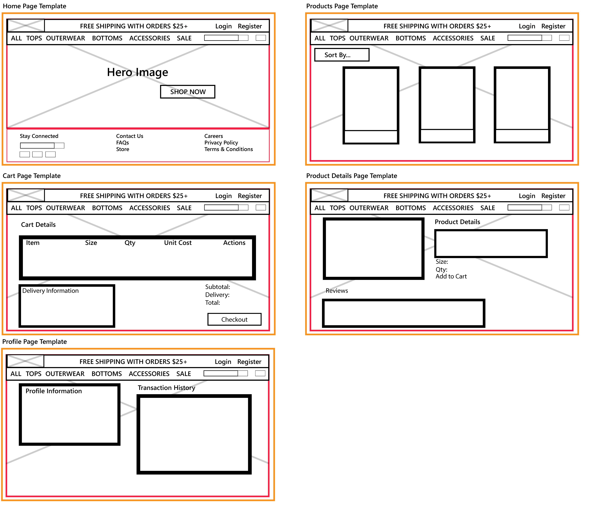
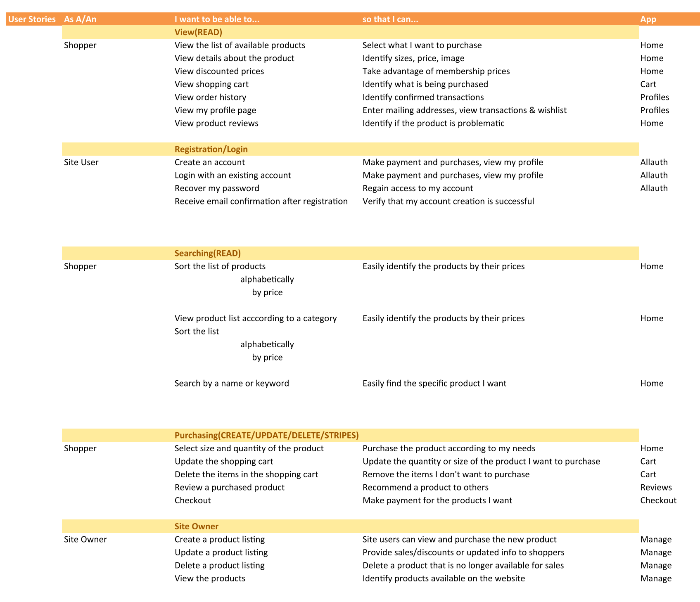
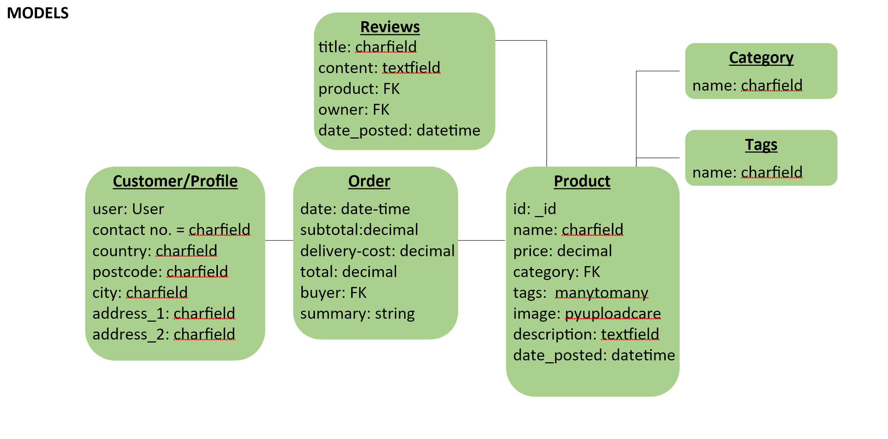

# Cleveland Cavaliers Team Shop
The website can be viewed [here](https://tgc-proj4-app.herokuapp.com/). Use the dummy staff account to gain access to the [Manage Product page](https://tgc-proj4-app.herokuapp.com/manage_product/) as a staff to manage data in the database. Use the dummy customer account to use the website as a regular customer.

1. Dummy Staff Account
- username: test
- password: t1e2s3t4

2. Dummy Customer Account
- username: testcustomer
- password: dummyaccount

## Full Stack Frameworks with Django Milestone Project
Build a full-stack website that allows user to manage a common dataset, which includes allowing users to share their own data with the community and having access to data by others. Main technologies used should include HTML, CSS, JavaScript, Python, Flask & Mongodb.

For the practice of my django and full-stack coding skills, I have decided to do a different spin on the official [Cavaliers Team Shop](https://www.cavaliersteamshop.com/) and setup a typical e-commerce website with basic functionalities such as presentation of products in database, manipulating data(e.g. user delivery address, cart items), making transactions online and keeping a order transaction history.

## Strategy
### Problem
The Cleveland Cavaliers sports team requires a platform to earn revenue by selling merchandises for fans like apparels & accessories. On the other hand, fans can gain access to the platform and purchase these products to show love and support for their favorite team.

### Proposed Solution
Create an e-commerce mobile-friendly website that can be accessed by fans to buy the fan goods they want.

### External Users' Goals
1. Fans will purchase fan goods to show support & love for their favorite team.

### Site Owner's Goals
1. Sell team merchandise to gain revenue, set up promotions and marketing. 
2. Allow fans to stay connected through social media links.
3. Provide excellent customer experience so that customers will visit the website again.

## Scope
### Required Functionalities
- CREATE/UPDATE/DELETE: Allow users to add, edit, remove products to their shopping cart. Allow site owners to add, edit, remove products in the database. Site owners can also add other information like tags & categories into the database.
- READ: Allow users and site owners to see what products are available in the database.
- Apps:
    1. Manage Products
        - This app allows site owners(staff) to manipulate the products, categories and tags data in the database. The main url is: [Manage Product page](https://tgc-proj4-app.herokuapp.com/manage_product/).
    2. Home
        - Essentially, this app is responsible for the bulk of frontend, presenting most information to users like the navigation bar, home page and products.
    3. Cart
        - This app is responsible for cart actions, such as adding to cart, removing from cart and updating the cart item.
    4. Checkout
        - This app handles the Stripe payment, and stores the user order transactions to the database after a successful checkout.
    5. Profile
        - This app provides the platform for users to see their transaction history and edit their delivery information.
    6. Reviews
        - This app allows users to leave a review on products they had purchased.

### Frontend
HTML
CSS
JS, JQUERY
Bootstrap

### Backend
Python(Django)
Postgres 

### API
UploadCare
Stripe Payment

### Merchandise Types
The site owner can add more categories, tags and products if they like. The test account is given access to the [Manage Product page](https://tgc-proj4-app.herokuapp.com/manage_product/)

1. Tops
2. Bottoms
3. Accessories
4. Outerwear

Current Tags: Out of Stock, Online Exclusive, Sale

## UX/Surface
### Wireframe/Concept

The concept/layout of the website is based on typical ecommerce websites like that of Uniqlo & Zalora.

### Color Scheme
The colors used in this website is based on the team colors of the Cleveland Cavaliers, which are gold, wine and black.

### User Stories

## Features
### Existing Features
#### Purchase Team Merchandise, Show Love for Cleveland Cavaliers!
The list of available team merchandise can be viewed by clicking on the links on the navigation bar. The product view can be filtered by their categories or tags(e.g. sale). The list of products can also be sorted alphabetically or according to their prices in ascending/descending order. The search on the navigation bar also allows users to search using a specific word or partial word. Clicking on the desired product takes the user to the product details page where you can read more information about the product and also add it into your cart. However, adding items to cart requires signing up for an account. Stripe payment is used for the online transaction. Use the dummy customer account to try it out. Product details page also includes its reviews made by other users who purchased them. Reviews for products can be left by the users only if they purchased it. The 'add review' button is located at the transaction history in the profile page. Reviews can be edited or deleted at the product's details page.

For orders above $20, the delivery fee is free. If not, it will be $10.

#### Profile Page
This page allows user to view and edit their delivery information, as well as to view their order transaction history. There can be potential features for this page which will be discussed later.

#### Manage Product Page
This page allows staff accounts to manage the information in the database, such as the creation of more products, categories and tags. The superuser can assign staff status to accounts that can be trusted to access this feature.

#### Mobile Version
The website is best viewed on laptops with at least 1200px. It supports small, medium and large-sized devices as well.

### Features Left to Implement
Due to the steeper learning curve of Django and project time constraints, many features that I want to implement to make the ecommerce website more complete were left out.

#### Sending Email for Verification
Emails can be sent out to users who register for an account so that they can have their email verified and gain access to the main features of the website.

#### Profiles: Multiple Addresses, Wishlist, Storing Address in Order Model
The profile app can allow for multiple addresses. Order made to the address should also be stored in the order transaction history, or to be more precise, the Order Model. A wishlist feature can be implemented for users to add products they want for future reference.

#### Products: Size Chart, Sales Prices, Rating, Pagination
The product details page can include features like star ratings in addition to reviews, pagination for better organization when the list of products/reviews/transaction history gets longer, and a size chart which gives users a reference to the sizes of apparels. Products with 'sale' tag can have their original prices displayed for comparison.

#### Discount Codes
Like most online shopping businesses these days, there can be a discount code system that provides various benefits to customers such as a price discount or free gifts.

## Technologies Used
- HTML
- CSS
- Javascript
- Jquery
- Bootstrap
- Python
- Django
- Postgres
- Google Fonts
- Font Awesome
- Visual Studio Code
- Git
- Github
- Heroku
- Google Chrome, Firefox
- Adobe Illustrator

## Testing
### Dummy Links
- Links in the footer
- Size chart
- Discount code

### Website Functions
- Clicking on the login/register link will load Django's allauth templates for user account creation etc.
- The links on the navigation bar will load the list of products according to their categories/tags. 
- Using the search function will load the search results of products containing the keyword in their descriptions, name or tags. (e.g. 'sal' will give results of products on sale)
- Clicking on the cart will load the cart details page. Cart items can be edited or deleted by clicking on the edit or trash icon.
- Clicking on a product will load its details page. Adding the item to cart will add the item with selected size and quantity to the cart.
- Reviews can be edited or deleted by its creator.
- Most user actions will receive feedback messages.
- Purchases below $20 will receive an order line of $10 delivery in Stripe checkout.
- Purchases can only be made when the user is logged in and when the delivery address is filled.
- The delivery information can be edited on the profile page by clicking on the edit icon to load the form.
- Clicking on the 'leave a review' button allows the user to create a review for the purchased product.

### Main Challenges
Learning Django was the steepest learning curve out of all the 4 projects so far. In addition to the time constraint for this project, I believe that more features can be implemented for the completeness of this website.

## Deployment
This project is coded on Visual Studio Code and respositories are on GitHub. The website is deployed on Heroku. The database was initially created on Django's sqlite but transferred into Postgres after deployment on Heroku.

To clone this project:

    Download/clone the master branch of this respository.
    Ensure that PIP, Visual Studio Code(or other code editors), Python and Git are in your system.
    Install required extensions/modules from requirements.txt by typing "pip -r requirements.txt" in the terminal.

Heroku:

    Create a new app and a Procfile that will allow the app to be deployed on Heroku.
    Input .env secret key values inside app settings. Set IP: 0.0.0.0 and Port:5000.
    Install Heroku CLI on Windows and login.
    To push to Heroku from VSC, enter 'git push heroku master'.

Others:

    You will need Django secret key, UploadCare secret & public keys, Stripe secret, publishable, endpoint secret keys, database url in your .env file. Use Python's load_dotenv() to implement these keys into the project. 

## Credits
### Media & Content
- Product images and descriptions are from [NBA Store EU](https://www.nbastore.eu/stores/nba/en/c/shop-by-team/eastern/cleveland-cavaliers).
- Hero image is from [fansided](https://fansided.com/wp-content/uploads/getty-images/2018/07/955143450.jpeg).
- Cleveland Cavaliers Wordmark is from [Wikipedia](https://en.wikipedia.org/).

### Acknowledgements
- This project is inspired by websites like [Cavaliers Team Shop](https://www.cavaliersteamshop.com/) and [Uniqlo](https://www.uniqlo.com/sg/#undefined).

- This is for educational use.